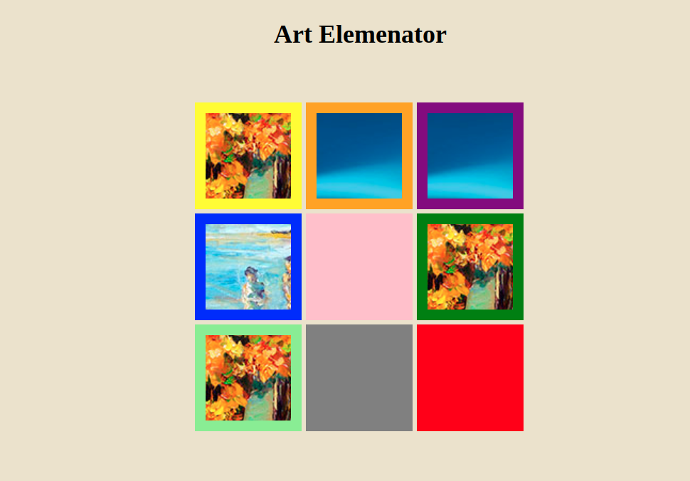

# _Art Elemenator_

#### _Version 1_
#### _Date 09/01/2020_
#### By _**Adilet Momunaliev**_

## Description

_User removes picture by clicking on it until last picture._

## Getting Started

These instructions will get you a copy of the project up and running on your local machine for development and testing purposes.

### Instruction

* Node js in your local machine
* git clone https://github.com/Adilet312/EventsInAction.git
* npm install
* npm run start
### Specifications
* A user can eliminate pictures from the box.
* ;
## Technologies Used

_HTML, CSS, JavaScript, DOM Elements and Methods, IDE Atom_

### License

*_Copyright (c) 2020 **Adilet Momunaliev**_*
